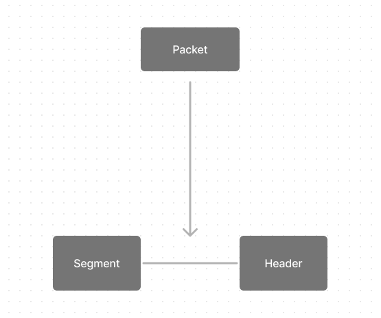
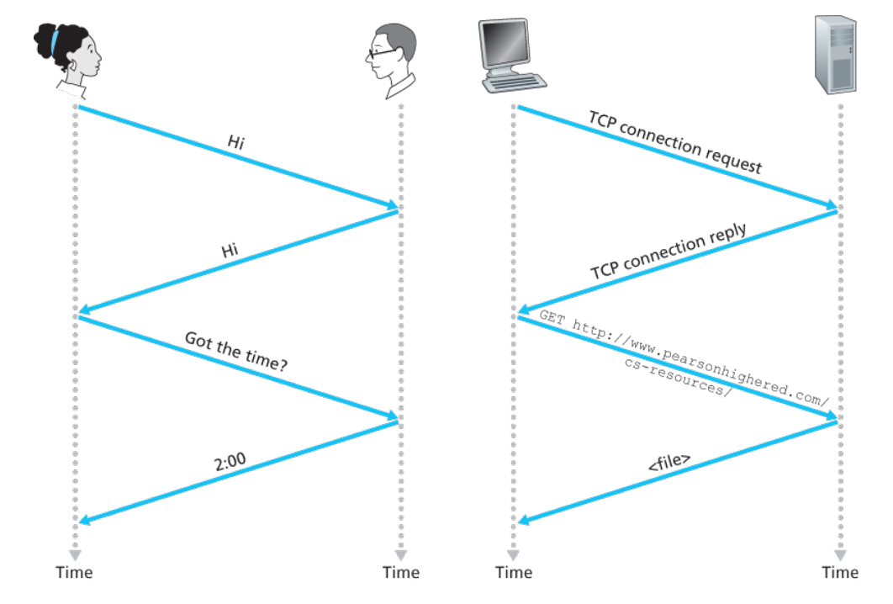

# 1.1 What is the Internet

-  When one end system has data to send to another end system, the sending end system
segments the data and adds header bytes to each segment. The resulting packages of information,
known as **packets**.

-  **packet = segment + header**

- **Packet switch** takes a packet arriving on one of its incoming communication links and forwards that packet on one of its outgoing communication links. **Examples of Packet Switchers**:  routers and link-layer switches.

 

- When data is transmitted from one computer (the sending end system) to another (the receiving end system), it doesn't travel directly. Instead, it moves through a series of interconnected devices such as routers, switches, and other networking equipment. This series of devices and connections constitutes the **route** or **path** through the network that the data packet takes. Each device along the route makes decisions about where to send the packet next based on factors like network congestion, available bandwidth, and routing protocols.
 

- A human protocol and a computer network protocol

 

- **Congestion-control protocols** in end systems control the rate at which packets
are transmitted between sender and receiver

 

- **How does our web page loads.**   Your computer will send a connection request message to the Web server and wait for a reply. The Web server will eventually receive your connection request message and return a connection reply message. Knowing that it is now OK to request the Web document, your computer then sends the name of the Web page it wants to fetch from that Web server in a GET message. Finally, the Web server returns the Web page (file) to your computer.

 

- A **protocol** defines the format and the order of messages exchanged between two or more communicating entities, as well as the actions taken on the transmission and/or receipt of a message or other event.